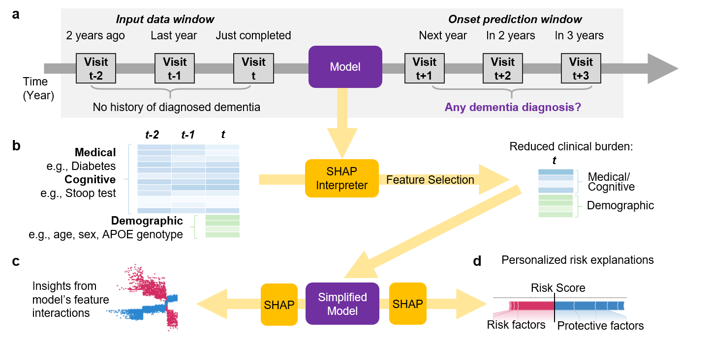

# Efficient and Explainable Risk Assessments for Imminent Dementia

This repository contains code for reproducing the results from our paper, "Efficient and Explainable Risk Assessments for Imminent Dementia in an Aging Cohort Study."

### Abstract
As the aging US population grows, scalable approaches are needed to identify individuals at risk for dementia. Common prediction tools have  limited predictive value, involve expensive neuroimaging, or require extensive and repeated cognitive testing.  None of these approaches scale to the sizable aging population who do not receive routine clinical assessments. Our study seeks a tractable and widely administrable set of metrics that can accurately predict imminent (i.e., within three years) dementia onset. To this end, we develop and apply a machine learning (ML) model to an aging cohort study with an extensive set of longitudinal clinical variables to highlight at-risk individuals with better accuracy than standard rudimentary approaches. Next, we reduce the burden needed to achieve accurate risk assessments for those deemed at risk by (1) predicting when consecutive clinical visits may be unnecessary, and (2) selecting a subset of highly predictive cognitive tests. Finally, we demonstrate that our method successfully provides individualized prediction explanations that retain non-linear feature effects present in the data. Our final model, which uses only four cognitive tests (less than 20 minutes to administer) collected in a single visit, affords predictive performance comparable to a standard 100-minute  neuropsychological battery and personalized risk explanations. Our approach shows the potential for an efficient tool for screening and explaining dementia risk in the general aging population.

### Overview of our approach

## Code
### Data Access 
Note: data files are not available in this repository due to data privacy. Instructions for accessing ROSMAP data via the AD Knowledge Portal are available [here](https://adknowledgeportal.synapse.org/DataAccess/Instructions). 

### Data Processing 
 - ***Data_Processing/***
    - **1_ROSMAP_preprocess_data_windows.ipynb** - Obtain samples with appropriate "input data window" and "prediction windows" for longitudinal risk prediction. Split samples into appropriate cross-validation and test sets. 
    - **2_standardizing_variables.ipynb** - Normalizes variables for modeling. 
    - **2.1_standardizing_variables-jbhi_revision.ipynb** - Additional analyses added for JBHI revision (added some analyses to determine which rows/columns to keep for missing data imputation experiements; code to do pre-processing for data with normalized cognition scores based on age/sex/edu )
    - **3_Processing_impute_and_stack_features.ipynb** - Perform some additional pre-processing for modeling.
    - **4_Downsampling.ipynb** - Implementation for various downsampling methods evaluated. 

 - ***Basic_Analyses/*** - This folder contains multiple analysis notebooks to identify high-level relationships among variables in the ROSMAP data set. 

### Modeling and Results
 - ***Models_and_Figures/***
    - **cross_validation_LR_and_GBDT.ipynb** - Examples of cross-validation training runs for the non-deep learning methods (LR and GBDT).
    - **cross_validation_MLP_and_LSTM.ipynb** - Examples of cross-validation training runs for deep learning methods (MLP and LSTM).
    - **summarize_CV_results.ipynb** - Compute average validation performance of all models. Generate plots comparing performance across different years of available data. 
    - **final_models.ipynb** - Train and obtain performance metrics for our model and all baselines.
    - **final_models-demographics_controlled_cognition.ipynb** - Model for predicting dementia onset from demographics-normalized cognition scores. 
    - **figures_scripts.ipynb** - Scripts to generate figures for the paper.
    - **processing_helper_functions.py** - Helper functions used in other notebooks to do final feature and label data processing.

## Additional Method Details and Results

### Selected hyperparameters for each model
We performed extensive 5-fold cross-validation over combinations of many hyperparameters to identify the best performing model of each 
model class. The final selected hyperparameters are provided below:

| Model | Hyperparameters |
|---|---|
| Logistic Regression (LR) | L2 regularization (C=1.0), optimized with L-BFGS solver; all other parameters set as the default Scikit-Learn parameters. |
| Gradient Boosted Decision Trees (GBDT) | Max tree depth = 4 layers; Minimum child weight = 0.25, learning rate = 0.1, log loss evaluation metric, patience = 5 rounds. |
| Long Short-Term Memory Networks (LSTM) | Structure:  LSTM node with 20 dimensions, followed by a 5-dimensional feed-forward layer with ReLU activation, followed by a dense layer with a sigmoid output.  The first two layers had a dropout probability of 0.1.  Optimized with Adam using binary cross-entropy loss.  Trained for up to 20 epochs with early stopping (and patience of 3 epochs), using batch sizes of 100. |
| Multi-layer Perceptrons (MLP) | Structure:  two hidden layers of size 30 and 5 (each with ReLU activations and dropout probability 0.1), followed by a dense layer output with a sigmoid activation.  Optimized with Adam using binary cross-entropy loss.  Trained for up to 20 epochs with early stopping (and patience of 3 epochs), using batch sizes of 100. |

### Cross-validation model results
We provide results for each combination of model class, downsampling approach, time-series encoding approach below. Each value is the average +- standard error over 5 validation folds:

| Model | Downsampling | Time-series encoding | CV Accuracy | CV AUROC | CV AUPRC |
|---|---|---|---|---|---|
| LR | Random | All data: current year | 0.8402 +- 0.0085 | 0.9226 +- 0.0031 | 0.6878 +- 0.0119 |
| | | All data: last 2 years | 0.8357 +- 0.0099 | 0.9200 +- 0.0039 | 0.6819 +- 0.0127 |
| | | All data: last 3 years | 0.8372 +- 0.0122 | 0.9154 +- 0.0042 | 0.6670 +- 0.0136 |
| | | Moving averages | 0.8369 +- 0.0109 | 0.9164 +- 0.0042 | 0.6697 +- 0.0138 |
| | | Slopes | 0.8370 +- 0.0124 | 0.9152 +- 0.0042 | 0.6668 +- 0.0134 |
| | Matched pairs | All data: current year | 0.8321 +- 0.0088 | 0.8964 +- 0.0036 | 0.6487 +- 0.0169 |
| | | All data: last 2 years | 0.8300 +- 0.0074 | 0.8935 +- 0.0055 | 0.6457 +- 0.0174 |
| | | All data: last 3 years | 0.8263 +- 0.0072 | 0.8890 +- 0.0050 | 0.6320 +- 0.0183 |
| | | Moving averages | 0.8264 +- 0.0069 | 0.8899 +- 0.0050 | 0.6353 +- 0.0185 |
| | | Slopes | 0.8261 +- 0.0075 | 0.8888 +- 0.0050 | 0.6318 +- 0.0183 |
| | None | All data: current year | 0.9032 +- 0.0038 | 0.9229 +- 0.0032 | 0.6927 +- 0.0087 |
| | | All data: last 2 years | 0.9054 +- 0.0034 | 0.9223 +- 0.0040 | 0.6941 +- 0.0111 |
| | | All data: last 3 years | 0.9045 +- 0.0048 | 0.9205 +- 0.0044 | 0.6893 +- 0.0110 |
| | | Moving averages | 0.9043 +- 0.0048 | 0.9206 +- 0.0043 | 0.6898 +- 0.0110 |
| | | Slopes | 0.9045 +- 0.0047 | 0.9204 +- 0.0044 | 0.6892 +- 0.0109 |
| | Re-weighting | All data: current year | 0.8447 +- 0.0086 | 0.9235 +- 0.0035 | 0.6952 +- 0.0110 |
| | | All data: last 2 years | 0.8446 +- 0.0104 | 0.9228 +- 0.0040 | 0.6951 +- 0.0131 |
| | | All data: last 3 years | 0.8461 +- 0.0095 | 0.9210 +- 0.0041 | 0.6906 +- 0.0132 |
| | | Moving averages | 0.8452 +- 0.0094 | 0.9212 +- 0.0040 | 0.6908 +- 0.0129 |
| | | Slopes | 0.8466 +- 0.0095 | 0.9209 +- 0.0041 | 0.6904 +- 0.0132 |
| GBDT | Random | All data: current year | 0.8276 +- 0.0111 | 0.9156 +- 0.0042 | 0.6670 +- 0.0085 |
| | | All data: last 2 years | 0.8372 +- 0.0104 | 0.9175 +- 0.0036 | 0.6663 +- 0.0131 |
| | | All data: last 3 years | 0.8323 +- 0.0107 | 0.9150 +- 0.0042 | 0.6585 +- 0.0141 |
| | | Moving averages | 0.8288 +- 0.0104 | 0.9133 +- 0.0032 | 0.6631 +- 0.0134 |
| | | Slopes | 0.8323 +- 0.0099 | 0.9171 +- 0.0033 | 0.6636 +- 0.0094 |
| | Matched pairs | All data: current year | 0.8261 +- 0.0101 | 0.8940 +- 0.0045 | 0.6134 +- 0.0116 |
| | | All data: last 2 years | 0.8340 +- 0.0100 | 0.8974 +- 0.0041 | 0.6235 +- 0.0102 |
| | | All data: last 3 years | 0.8360 +- 0.0104 | 0.8973 +- 0.0052 | 0.6237 +- 0.0091 |
| | | Moving averages | 0.8284 +- 0.0069 | 0.8951 +- 0.0045 | 0.6290 +- 0.0116 |
| | | Slopes | 0.8379 +- 0.0084 | 0.9000 +- 0.0050 | 0.6338 +- 0.0132 |
| | None | All data: current year | 0.9041 +- 0.0047 | 0.9164 +- 0.0033 | 0.6731 +- 0.0128 |
| | | All data: last 2 years | 0.9029 +- 0.0041 | 0.9176 +- 0.0041 | 0.6767 +- 0.0123 |
| | | All data: last 3 years | 0.9046 +- 0.0045 | 0.9163 +- 0.0044 | 0.6763 +- 0.0132 |
| | | Moving averages | 0.9034 +- 0.0057 | 0.9132 +- 0.0046 | 0.6721 +- 0.0117 |
| | | Slopes | 0.9040 +- 0.0045 | 0.9164 +- 0.0042 | 0.6780 +- 0.0130 |
| | Re-weighting | All data: current year | 0.8456 +- 0.0097 | 0.9169 +- 0.0043 | 0.6746 +- 0.0162 |
| | | All data: last 2 years | 0.8519 +- 0.0105 | 0.9199 +- 0.0044 | 0.6819 +- 0.0159 |
| | | All data: last 3 years | 0.8501 +- 0.0111 | 0.9180 +- 0.0049 | 0.6774 +- 0.0159 |
| | | Moving averages | 0.8491 +- 0.0084 | 0.9154 +- 0.0042 | 0.6709 +- 0.0185 |
| | | Slopes | 0.8517 +- 0.0096 | 0.9183 +- 0.0037 | 0.6778 +- 0.0126 |
| MLP | Random | All data: current year | 0.8198 +- 0.0156 | 0.9030 +- 0.0118 | 0.6701 +- 0.0158 |
| | | All data: last 2 years | 0.8276 +- 0.0102 | 0.9124 +- 0.0048 | 0.6714 +- 0.0110 |
| | | All data: last 3 years | 0.8148 +- 0.0146 | 0.9109 +- 0.0052 | 0.6691 +- 0.0106 |
| | | Moving averages | 0.8188 +- 0.0113 | 0.9056 +- 0.0029 | 0.6583 +- 0.0104 |
| | | Slopes | 0.8228 +- 0.0131 | 0.9037 +- 0.0090 | 0.6467 +- 0.0099 |
| | Matched pairs | All data: current year | 0.8222 +- 0.0089 | 0.9004 +- 0.0050 | 0.6470 +- 0.0112 |
| | | All data: last 2 years | 0.8154 +- 0.0156 | 0.8822 +- 0.0127 | 0.6140 +- 0.0109 |
| | | All data: last 3 years | 0.8222 +- 0.0081 | 0.8893 +- 0.0028 | 0.6292 +- 0.0145 |
| | | Moving averages | 0.8252 +- 0.0102 | 0.8956 +- 0.0068 | 0.6441 +- 0.0126 |
| | | Slopes | 0.8293 +- 0.0104 | 0.8937 +- 0.0039 | 0.6232 +- 0.0100 |
| | None | All data: current year | 0.9011 +- 0.0040 | 0.9188 +- 0.0026 | 0.6848 +- 0.0077 |
| | | All data: last 2 years | 0.9030 +- 0.0054 | 0.9191 +- 0.0036 | 0.6761 +- 0.0105 |
| | | All data: last 3 years | 0.9036 +- 0.0056 | 0.9186 +- 0.0050 | 0.6694 +- 0.0144 |
| | | Moving averages | 0.9013 +- 0.0034 | 0.9133 +- 0.0035 | 0.6705 +- 0.0080 |
| | | Slopes | 0.9002 +- 0.0043 | 0.8940 +- 0.0218 | 0.6670 +- 0.0135 |
| | Re-weighting | All data: current year | 0.8322 +- 0.0083 | 0.9184 +- 0.0038 | 0.6933 +- 0.0107 |
| | | All data: last 2 years | 0.8433 +- 0.0099 | 0.9207 +- 0.0039 | 0.6887 +- 0.0124 |
| | | All data: last 3 years | 0.8459 +- 0.0090 | 0.9211 +- 0.0041 | 0.6952 +- 0.0159 |
| | | Moving averages | 0.8348 +- 0.0106 | 0.9151 +- 0.0037 | 0.6763 +- 0.0060 |
| | | Slopes | 0.8400 +- 0.0107 | 0.9111 +- 0.0061 | 0.6765 +- 0.0067 |
| LSTM | Random | All data: current year | 0.8312 +- 0.0105 | 0.9213 +- 0.0035 | 0.6894 +- 0.0137 |
| | | All data: last 2 years | 0.8315 +- 0.0105 | 0.9188 +- 0.0036 | 0.6834 +- 0.0119 |
| | | All data: last 3 years | 0.8108 +- 0.0103 | 0.9103 +- 0.0031 | 0.6564 +- 0.0087 |
| | Matched pairs | All data: current year | 0.8213 +- 0.0113 | 0.8932 +- 0.0047 | 0.6398 +- 0.0090 |
| | | All data: last 2 years | 0.8313 +- 0.0083 | 0.8974 +- 0.0030 | 0.6346 +- 0.0117 |
| | | All data: last 3 years | 0.8060 +- 0.0059 | 0.8884 +- 0.0027 | 0.6224 +- 0.0111 |
| | None | All data: current year | 0.9022 +- 0.0039 | 0.9032 +- 0.0175 | 0.6677 +- 0.0096 |
| | | All data: last 2 years | 0.9045 +- 0.0046 | 0.9197 +- 0.0046 | 0.6699 +- 0.0089 |
| | | All data: last 3 years | 0.9021 +- 0.0050 | 0.9047 +- 0.0168 | 0.6691 +- 0.0189 |
| | Re-weighting | All data: current year | 0.8373 +- 0.0095 | 0.9208 +- 0.0033 | 0.6807 +- 0.0123 |
| | | All data: last 2 years | 0.8526 +- 0.0154 | 0.9199 +- 0.0048 | 0.6909 +- 0.0123 |
| | | All data: last 3 years | 0.8338 +- 0.0097 | 0.9217 +- 0.0038 | 0.6980 +- 0.0144 |
